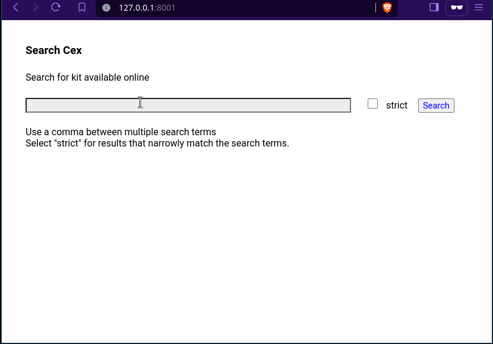

# cexfind

A Go cli and web app for rapid and effective searches for equipment on
Cex/Webuy using the unofficial `webuy.io` json search endpoint.

## Usage

**web server**

Run `./bin/webserver-linux-amd64` to run the server locally on the
default local ip address of `127.0.0.1` and port `8000`. Use the command
line switches to change these options. (Use `-h` to see the switches.)

**cli**

Run `./bin/cli-linux-amd64 -strict -query "lenovo t480s" -query "lenovo x390"`

## Licence

This project is licensed under the [MIT Licence](LICENCE).
