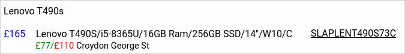

# cexfind

v0.2.8 : 22 January 2025 : add store distances

If you supply a postcode, cexfind will show the distance to stores from
that location. The store locations are updated daily in local cache,
so should be pretty fast to lookup.

The lookup for the supplied postcode uses
[api.postcodes.io](https://api.postcodes.io/). Let's see how that goes.

## Find kit on Cex, fast

[Try it out on GCP!](https://cexfind-min-poyflf5akq-nw.a.run.app/)

This project is a Go module with console, cli and web app clients for
rapid and effective searches for second hand equipment for sale at
Cex/Webuy using the unofficial `webuy.io` json search endpoint.

Note that these programs only work for queries made in the UK (or via a
proxy terminating in the UK). This is intended to be a fun project and
is not intended for commercial use.

## Usage

Simply download the binaries for your machine's architecture from
[releases](https://github.com/rorycl/cexfind/releases). Alternatively,
build for your local machine using `make build-all` if you have go (>=
1.22) installed. The resulting binaries can be found in `bin`.

## Clients

**web server**

A simple htmx webserver client.

Run `./bin/webserver` or the windows alternative to run the server
locally on the default local ip address of `127.0.0.1` and port `8000`.
Use the command line switches to change these options. (Use `-h` to see
the switches.)

Three clients are provided for the very simple `cexfind` golang module:

**console**

A [bubbletea](https://github.com/charmbracelet/bubbletea) console app.

Have a look at the app [README](cmd/console/README.md) for more info
about the architecture of this client.

**cli**

A simple cli client.

Run `./bin/cli -h` or the windows alternative to see the switch options.

## Licence

This project is licensed under the [MIT Licence](LICENCE).
