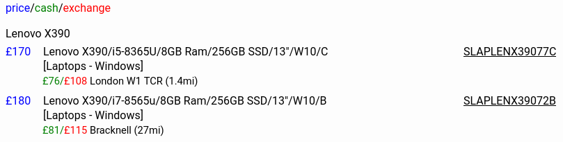
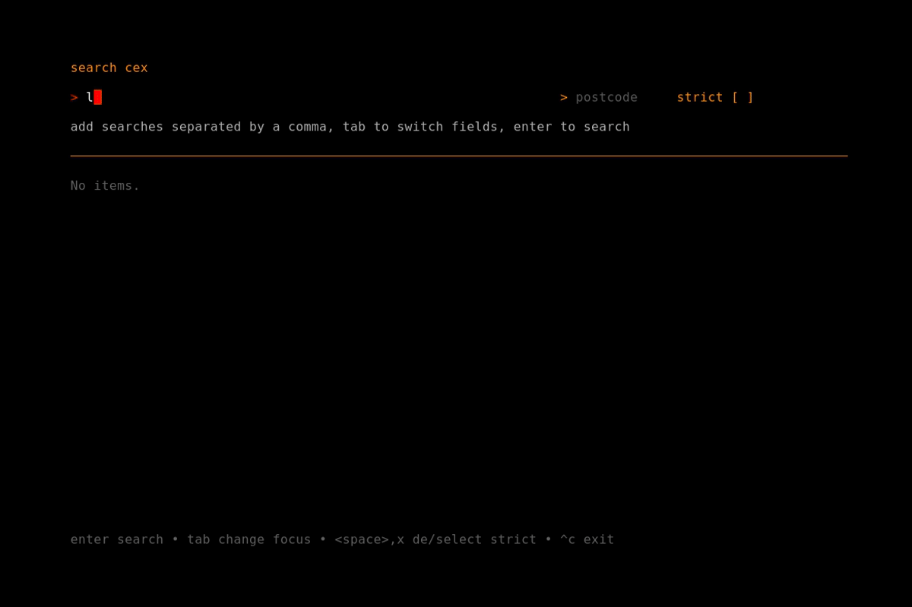

# cexfind

v0.3.0 : 29 January 2025 : add location service unavailability checks

This release exposes location service unavailability in the Cexfind
library and apps.

[Try it out on GCP!](https://cexfind-min-poyflf5akq-nw.a.run.app/)

## Find kit on Cex, fast

This project is a Go module with console, cli and web app clients for
rapid and effective searches for second hand equipment for sale at
Cex/Webuy using the unofficial `webuy.io` json search endpoint.

Note that these programs only work for queries made in the UK (or via a
proxy terminating in the UK). This is intended to be a fun project not
intended for commercial use.

## Usage

Simply download the binaries for your machine's architecture from
[releases](https://github.com/rorycl/cexfind/releases). Alternatively,
build for your local machine using `make build-all` if you have go (>=
1.22) installed. The resulting binaries can be found in `bin`.

## Clients

Three clients are provided:

**web server**

A simple htmx webserver client.

Run `./bin/webserver` or the windows alternative to run the server
locally on the default local ip address of `127.0.0.1` and port `8000`.
Use the command line switches to change these options. (Use `-h` to see
the switches.)

**console**

A [bubbletea](https://github.com/charmbracelet/bubbletea) console app.

Have a look at the app [README](cmd/console/README.md) for more info
about the architecture of this client.

**cli**

A simple cli client.

Run `./bin/cli -h` or the windows alternative to see the switch options.

## Licence

This project is licensed under the [MIT Licence](LICENCE).
