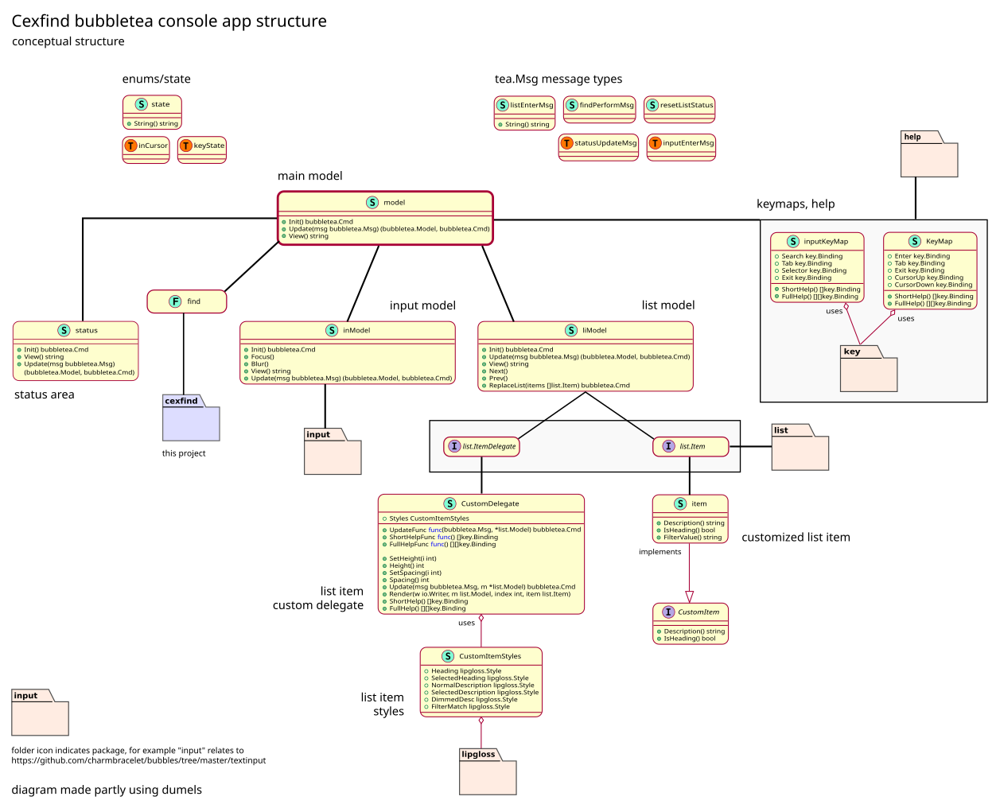

# cexfind console app

This console app is written using the
[bubbletea](https://github.com/charmbracelet/bubbletea) TUI framework.

## Structure

The app is structured around a main model which contains a list and
input model, together with a status area. The use of a custom list item
delegate is adapted from the example provided in the bubbletea
"list-fancy" example.



The bubbletea repo includes two short but informative tutorials about
the bubbletea ELM architecture and commands.

I also found the Charm video on YouTube about the mini-project
[kancli](https://www.youtube.com/watch?v=ZA93qgdLUzM) helpful. The
`kancli` app is a simple cli kanban board with several models.

Commands (as explained in the tutorial/commands/README.md) are
particularly fun to use. For example the following `case` in the main
model's Update function is triggered on a `listEnterMsg`, which
temporarily sets the status area to notify the user of text having been
copied to the clipboard. This event itself triggers an asynchronous
update to reset the status area after 2.5s.

```go
// data was selected in the list view; reset the status after a
// short wait
case listEnterMsg:
	clipboard.Write(clipboard.FmtText, []byte(msg.url))
	m.status = m.status.setCopied(msg.String())
	return m, func() tea.Msg {
		time.Sleep(2500 * time.Millisecond)
		return resetListStatus{}
	}
```
