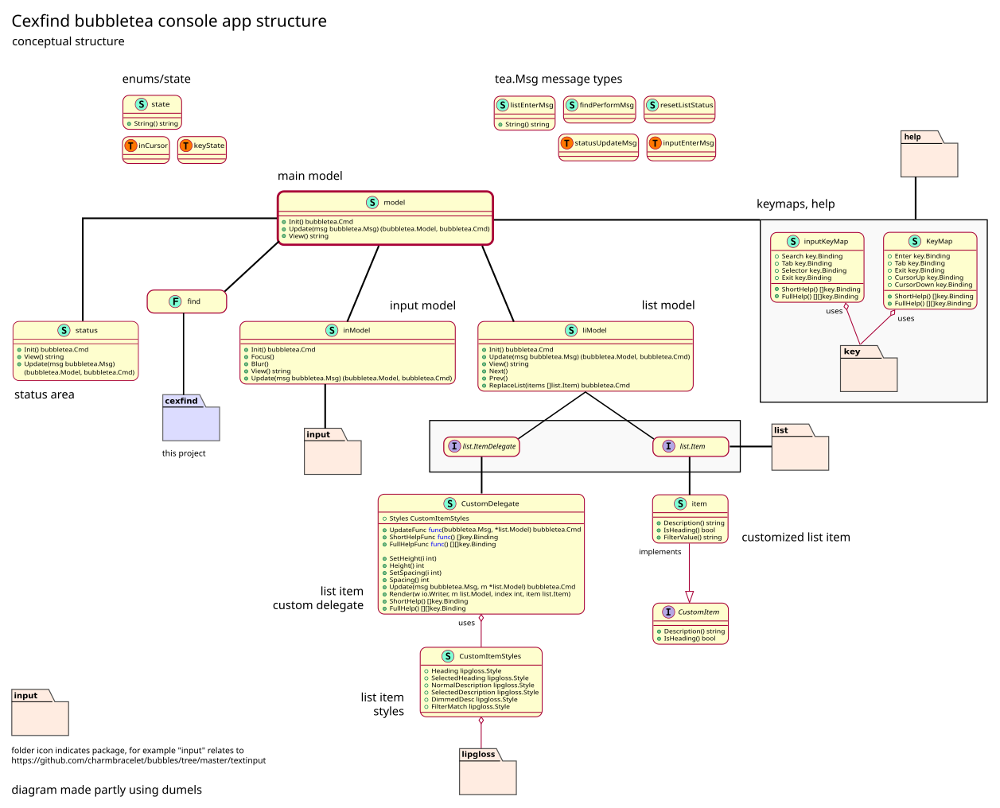

# cexfind console app

This console app is written using the
[bubbletea](https://github.com/charmbracelet/bubbletea) TUI framework.

## Structure

The app is structured around a main model which contains a list and
input model, together with a status area. The use of a custom list item
delegate is adapted from the example provided in the bubbletea
"list-fancy" example.



I found it helpful to watch the Charm
[kancli](https://www.youtube.com/watch?v=ZA93qgdLUzM) simple cli kanban
board helpful to understand the relationship between models, together
with the two short but invaluable tutorials in the bubbletea repo.

Commands (as explained in the tutorial/commands/README.md) are
particularly fun and to use once one has got to grips with the ELM
architecture. For example the following `case` in the main model's
Update function is triggered on a `listEnterMsg`, which temporarily sets
the status area to notify the user of text having been copied to the
clipboard. This event which itself triggers an asynchronous update to
the status area to reset status after 2.5s.

```go
// data was selected in the list view; reset the status after a
// short wait
case listEnterMsg:
	clipboard.Write(clipboard.FmtText, []byte(msg.url))
	m.status = m.status.setCopied(msg.String())
	return m, func() tea.Msg {
		time.Sleep(2500 * time.Millisecond)
		return resetListStatus{}
	}
```
