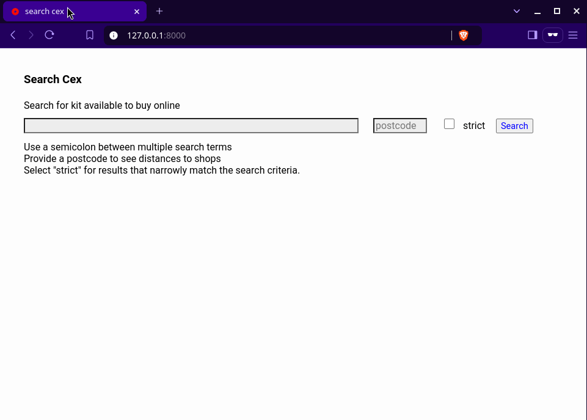

# webserver



The animated gif was made with Charm [vhs](https://github.com/charmbracelet/vhs).

## Usage

```
Usage of ./webserver:
  -address string
    	server network address (default "127.0.0.1")
  -port string
    	server network port (default "8000")
  -proxy string
    	proxy, such as 'socks5://127.0.0.1:8081'

run a webserver to search Cex/Webuy for second hand equipment

eg <programme> -address 192.168.4.5 -port 8001
```
